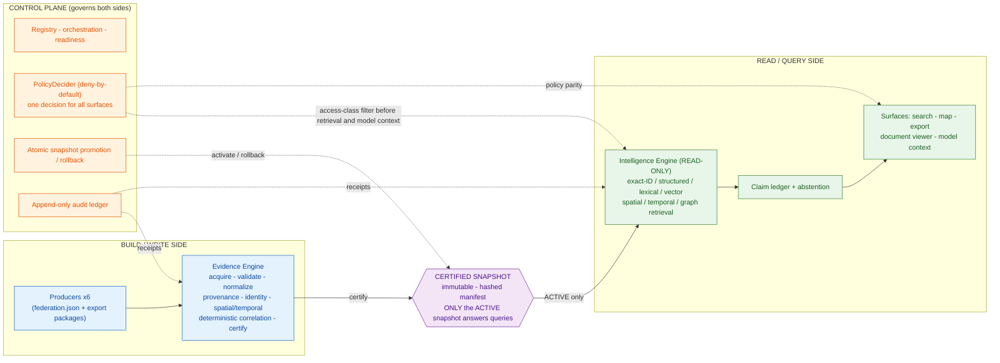
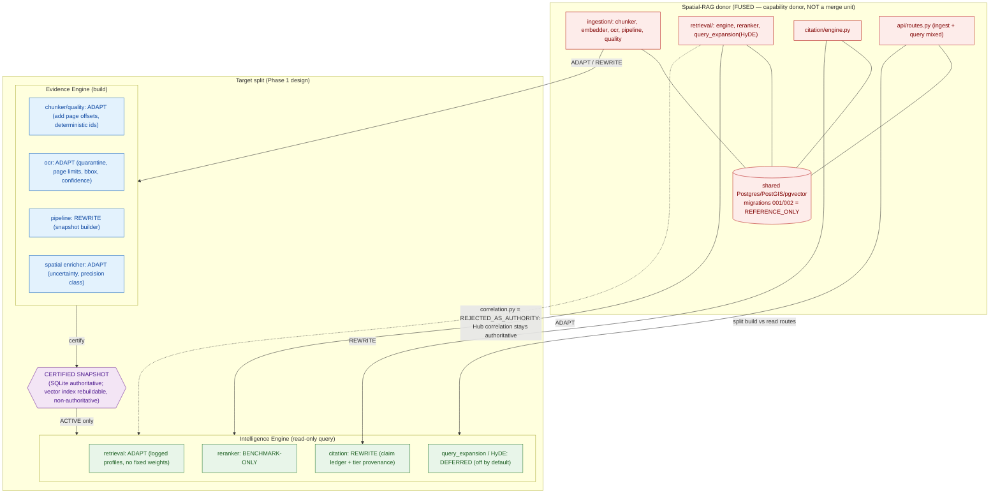

# THEHUB Dual-Engine Architecture — Overview

A plain-language + diagram companion to the handoff specs (`01_ARCHITECTURE_SPEC.md`,
`SNAPSHOT_STATE_MACHINE.json`, `SECURITY_MODEL.json`) and the Phase-1 contract drafts
(`../phase1-design/`). Design/documentation only — no code.

## The one-line model

**A build (write) side and a read-only query side, separated by an immutable certified-snapshot
boundary that a control plane governs.** It reads as "two-sided," but it is formally **three layers** —
the Control Plane is the referee that owns certification, promotion, and access policy across both sides.

| Side | Layer(s) | Owns | Direction |
|---|---|---|---|
| Build / analysis-execution | **Evidence Engine** (orchestrated by **Control Plane**) | acquisition, validation, normalization, provenance, reversible identity, spatial/temporal, deterministic correlation, **certification** | writes evidence |
| Query / fetch | **Intelligence Engine** | retrieval, comparison, citation, claims, contradictions, abstention, visualization | **read-only** |

## Diagram 1 — three-layer / two-sided model with the snapshot boundary

**Invariants shown (from `SNAPSHOT_STATE_MACHINE.json` / `SECURITY_MODEL.json`):**
- The snapshot is the **sole integration boundary**; the two sides never touch directly.
- Only an **`ACTIVE`** snapshot answers normal queries; a failed evidence/index build (`INDEX_FAILED`)
  never mutates the current `ACTIVE` snapshot (atomic promote/rollback).
- The Intelligence Engine is **read-only** — no mutation surface against canonical evidence.
- One `PolicyDecider.decide()` governs **search, map, export, viewer, and model context** identically
  (access-policy parity); classification filters run **before** retrieval and **before** model context.
- Every lifecycle transition and policy decision emits an immutable audit receipt.

## Diagram 2 — mapping the Spatial-RAG donor onto the split

The donor (`spatialragv2.zip`) is *two-sided in its own code* but **fused** (ingestion routes and query
routes share one Postgres DB). The migration **splits** it into the Evidence vs Intelligence engines with
the snapshot + policy inserted between. Dispositions are from `APPROVED_COMPONENT_LEDGER.csv` — every row
is `code_movement_authorized = NO` (design targets, not extractions).

## How this maps to the certified baseline

- The Hub today already owns the **build side** in miniature: 6 producers → `hub fetch` → `hub aggregate`
  → deterministic `hub correlate` → `hub ingest` into **SQLite `data/hub.db`** (authoritative), across
  **8 canonical streams** (sources, entities, relationships, funding_awards, transactions, observations,
  alerts, correlations). See `../phase0/BASELINE_COUNTS.json`.
- **SQLite stays authoritative**; the Spatial-RAG PostgreSQL/PostGIS/pgvector schema is **reference-only**
  and is never applied to the Hub (`../phase0/SPATIAL_RAG_REPRODUCTION_LEDGER.md`).
- The read-only boundary, no-LLM structured query, snapshot lifecycle, and claim/abstention contracts are
  drafted in `../phase1-design/` (schemas + `INTERFACES_DESIGN.md`).

## What is deliberately NOT in the picture (retained HOLD)

No direct ZIP merge · no Spatial SQL applied to the Hub · HyDE off by default · no automatic entity
merges · the existing Hub deterministic correlation remains the sole cross-producer authority ·
Phase-1 *implementation* is not started.
